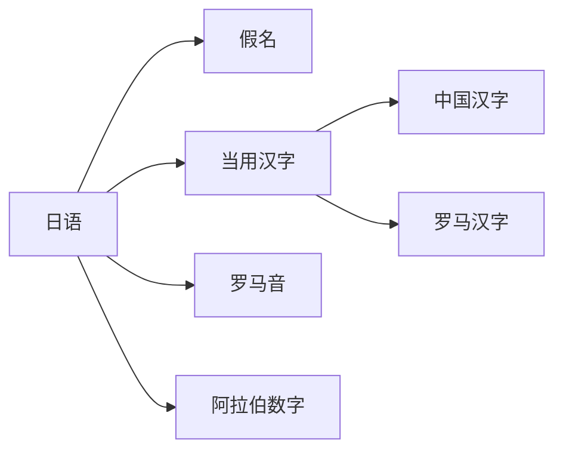
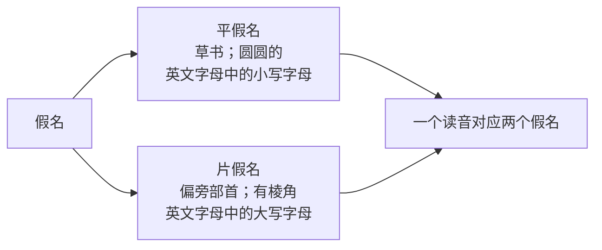

- [基础阶段](#基础阶段)
  - [日语五十音图精讲](#日语五十音图精讲)
    - [日语五十音图介绍](#日语五十音图介绍)
      - [日语的文字分类](#日语的文字分类)
      - [假名的分类](#假名的分类)
  - [五十音图图标--基础发音](#五十音图图标--基础发音)
    - [第一篇あか行](#第一篇あか行)
- [强化阶段](#强化阶段)
- [突破阶段](#突破阶段)
- [备考阶段](#备考阶段)
- [冲刺阶段](#冲刺阶段)

# 基础阶段
## 日语五十音图精讲
### 日语五十音图介绍
#### 日语的文字分类

**五十音图 → 假名**
#### 假名的分类

## 五十音图图标--基础发音
### 第一篇あか行

# 强化阶段
# 突破阶段
# 备考阶段
# 冲刺阶段
