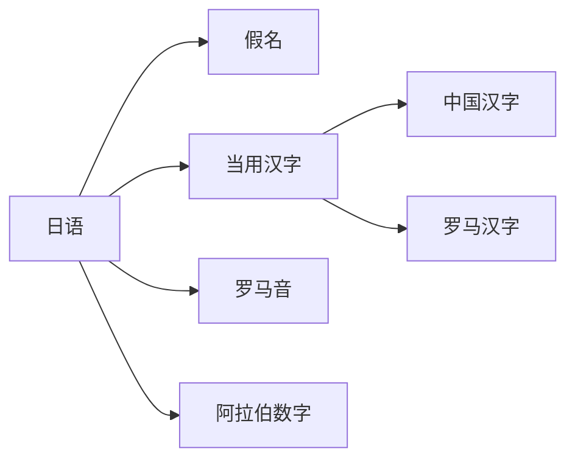
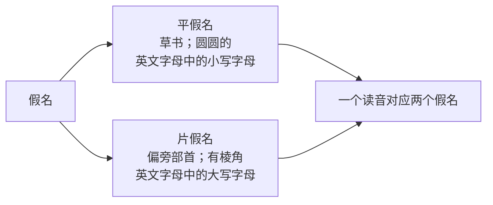

- [基础阶段](#基础阶段)
  - [日语五十音图精讲](#日语五十音图精讲)
    - [日语五十音图介绍](#日语五十音图介绍)
      - [日语的文字分类](#日语的文字分类)
      - [假名的分类](#假名的分类)
  - [五十音图图标--基础发音](#五十音图图标--基础发音)
    - [⭐五十音图与日语键盘](#五十音图与日语键盘)
    - [第一篇あか行](#第一篇あか行)
- [强化阶段](#强化阶段)
- [突破阶段](#突破阶段)
- [备考阶段](#备考阶段)
- [冲刺阶段](#冲刺阶段)

# 基础阶段
## 日语五十音图精讲
### 日语五十音图介绍
#### 日语的文字分类

**五十音图 → 假名**
#### 假名的分类

## 五十音图图标--基础发音
### ⭐五十音图与日语键盘
 
 
### 第一篇あか行
| **罗马音** | **片假名** | **片假名** | **中文** |
| :--------: | :--------: | :--------: | -------- |
|     a      |     あ     |     ア     | 阿       |
|     i      |     い     |     イ     | 以       |
|     u      |     う     |     ウ     | 宇       |
|     e      |     え     |     エ     | 衣       |
|     o      |     お     |     オ     | 我       |

| **罗马音** | **片假名** | **片假名** | **中文** |
| :--------: | :--------: | :--------: | -------- |
|     ka     |     か     |     カ     | 加       |
|     ki     |            |            |          |
|     ku     |            |            |          |
|     ke     |            |            |          |
|     ko     |            |            |          |
# 强化阶段
# 突破阶段
# 备考阶段
# 冲刺阶段 