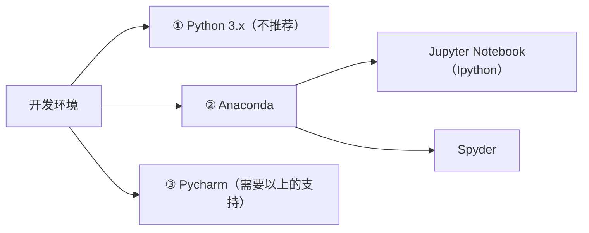

>课程链接：https://www.deepshare.net/class/detail/59/   

- [第 1 章 | 绪论与环境配置](#第-1-章--绪论与环境配置)
- [第 2 章 | Python基本语法元素](#第-2-章--python基本语法元素)
- [第 3 章 | 基本数据类型](#第-3-章--基本数据类型)
- [第 4 章 | 组合数据类型](#第-4-章--组合数据类型)
- [第 5 章 | 程序控制结构](#第-5-章--程序控制结构)
- [第 6 章 | 函数-面向过程的编程](#第-6-章--函数-面向过程的编程)
- [第 7 章 | 类-面向对象的编程](#第-7-章--类-面向对象的编程)
- [第 8 章 | 文件、异常和模块](#第-8-章--文件异常和模块)
- [第 9 章 | 有益的探索](#第-9-章--有益的探索)
- [第 10 章 | Python标准库](#第-10-章--python标准库)
- [第 11 章 | 科学计算库-Numpy应用](#第-11-章--科学计算库-numpy应用)
- [第 12 章 | 数据分析处理库-Pandas应用](#第-12-章--数据分析处理库-pandas应用)
- [第 13 章 | 数据可视化库-Matplotlib应用](#第-13-章--数据可视化库-matplotlib应用)
- [第 14 章 | Python之Sklearn常规用法](#第-14-章--python之sklearn常规用法)

# 第 1 章 | 绪论与环境配置

# 第 2 章 | Python基本语法元素
# 第 3 章 | 基本数据类型
# 第 4 章 | 组合数据类型
# 第 5 章 | 程序控制结构
# 第 6 章 | 函数-面向过程的编程
# 第 7 章 | 类-面向对象的编程
# 第 8 章 | 文件、异常和模块
# 第 9 章 | 有益的探索
# 第 10 章 | Python标准库
# 第 11 章 | 科学计算库-Numpy应用
# 第 12 章 | 数据分析处理库-Pandas应用
# 第 13 章 | 数据可视化库-Matplotlib应用
# 第 14 章 | Python之Sklearn常规用法 
