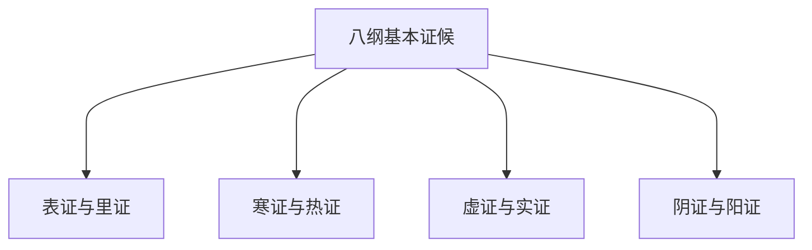
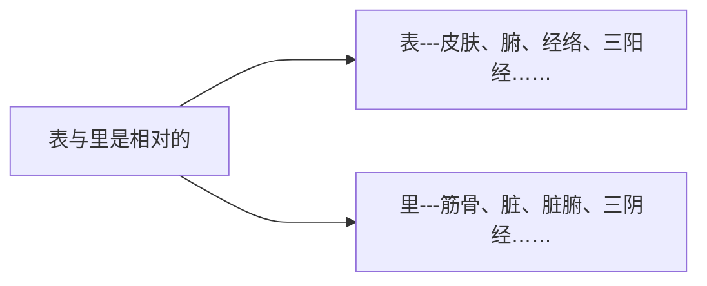
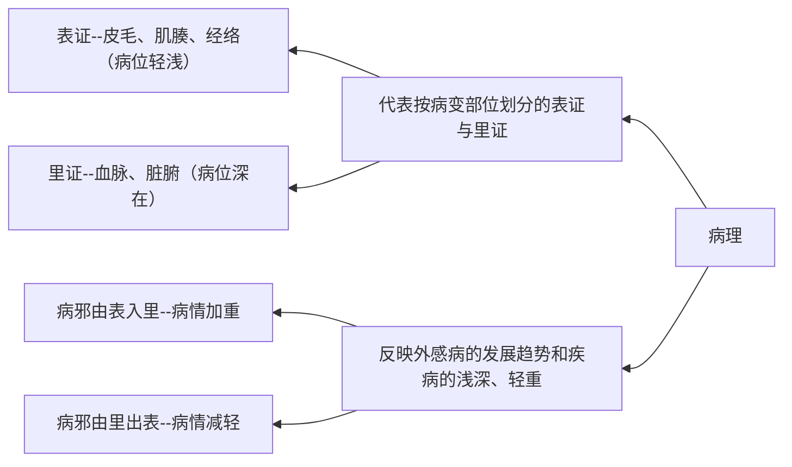
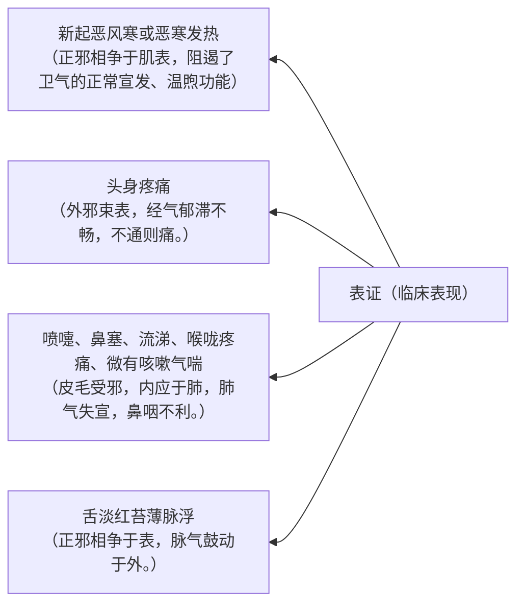
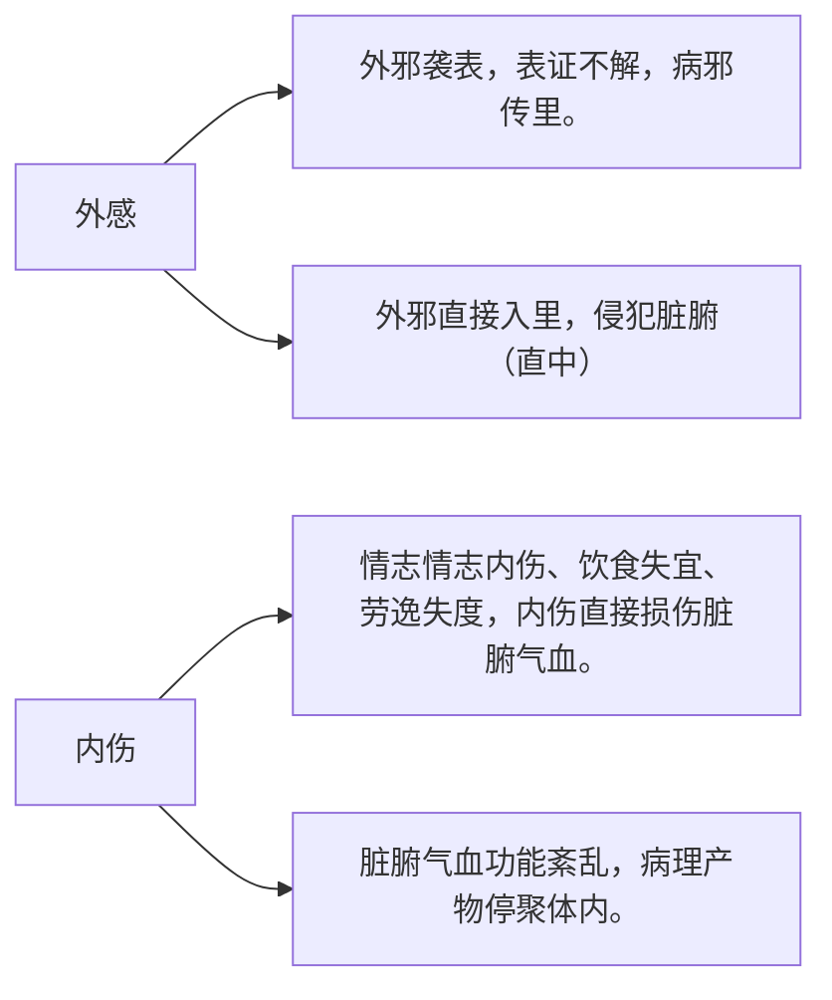

[中医诊断学](https://www.bilibili.com/video/BV1Kg411c7NC/)  
课程链接：https://www.bilibili.com/video/BV1Kg411c7NC/
- [八纲辨证](#八纲辨证)
- [表证与里证](#表证与里证)
  - [含义](#含义)
  - [病理](#病理)
  - [表证](#表证)
  - [里证](#里证)
  - [半表半里证](#半表半里证)

### 八纲辨证  

### 表证与里证  
#### 含义
>从生理的角度：说明人体脏腑、组织器官及经络部位的相对浅深。  

#### 病理

#### 表证
>表证的表现与日常中“感冒”最相似。

>辨识要点：新起恶寒发热、鼻咽等肺系症状及脉浮等。
#### 里证
>证候分析：形成途径有外感和内伤两个方面。

>辨识要点：脏腑、气血津液等功能失常所致表现。

#### 半表半里证
> 含义：病变既非完全在表，又未完全入里，病位处于表里进退变化之中。  

*临床表现：寒热表现以寒热往来为特征。*  
*证候分析：邪正分争，少阳枢机不利。*

